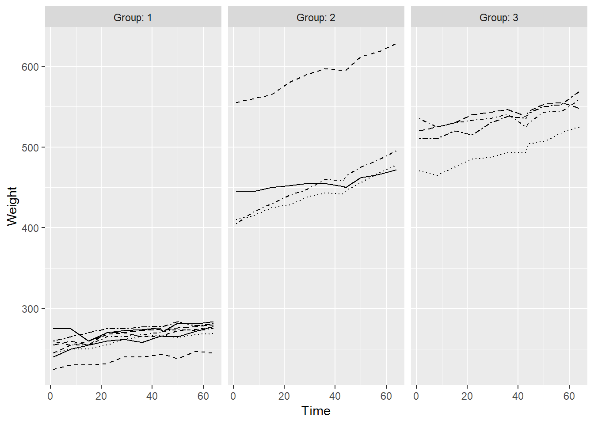
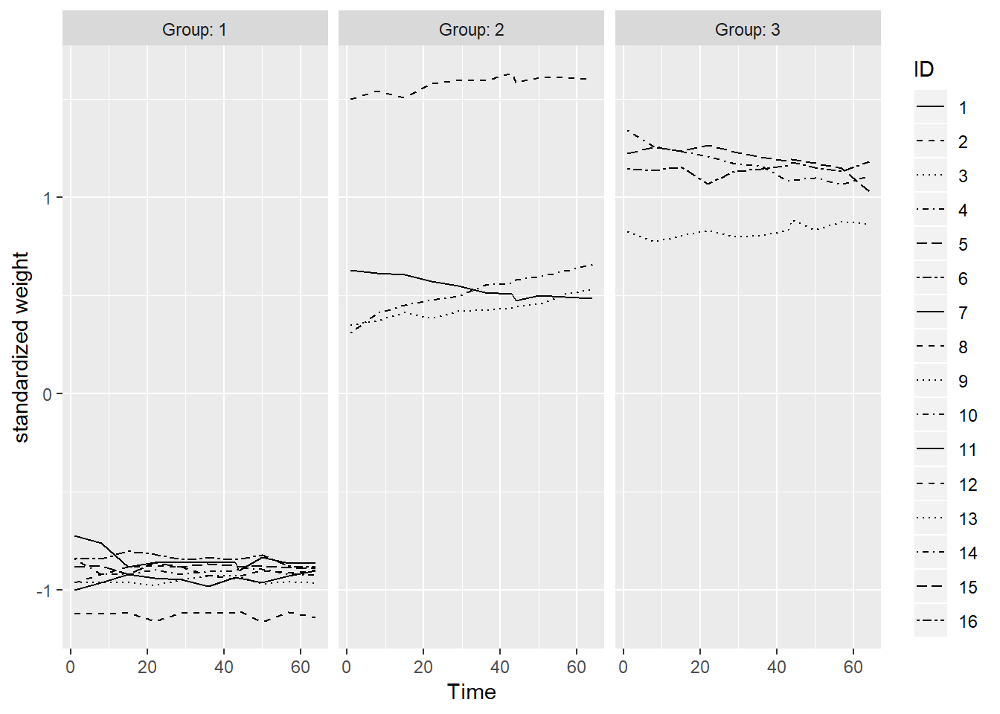
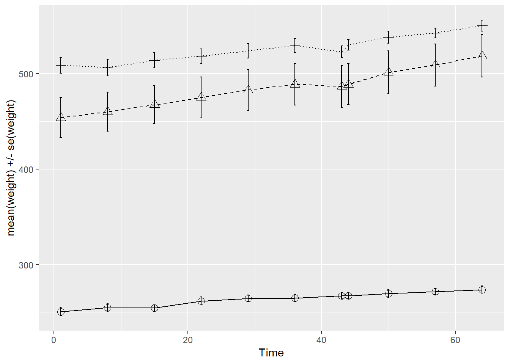
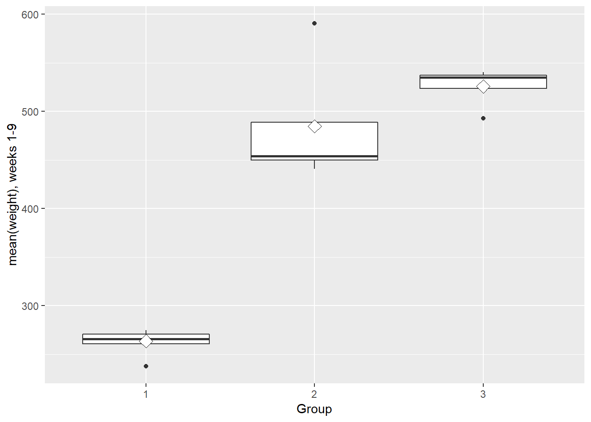
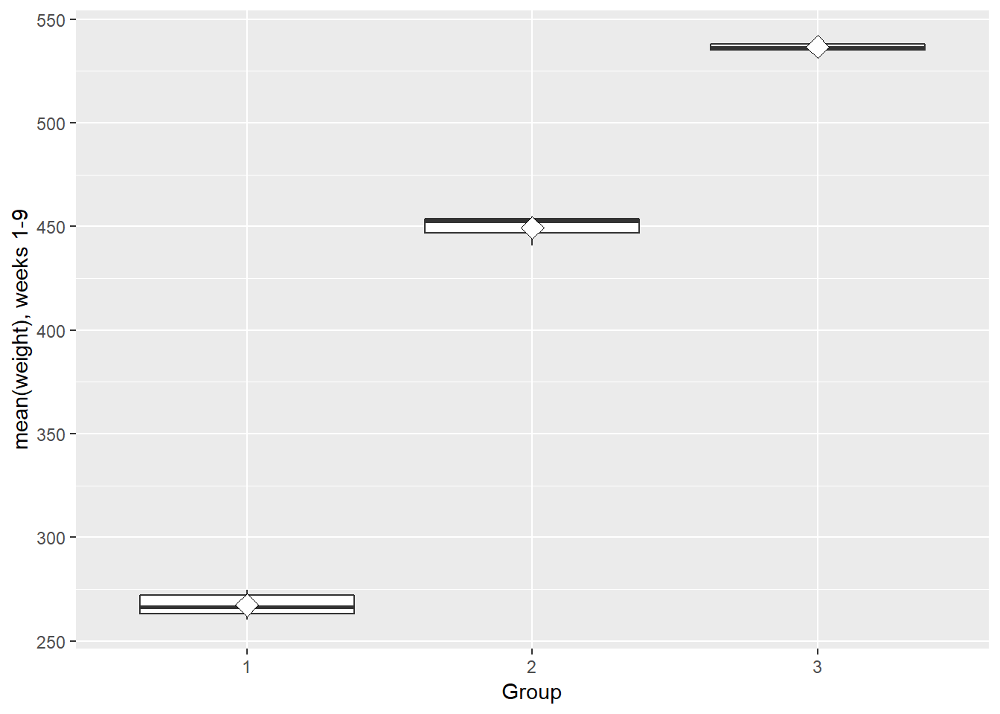
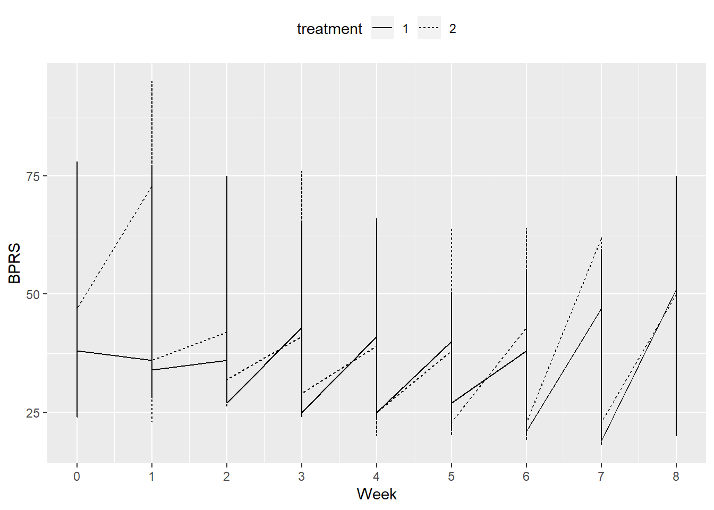

# 5. Analysis of longitudinal data

The last chapter (or topic) of the course takes us back to the task of building **statistical models**, after having worked the last two weeks with multivariate, mostly explorative, even heuristic techniques that are common in data science, including machine learning.

The new challenge here is that the data may (and will) include **two types of dependencies simultaneously**: In addition to the more or less correlated variables that we have faced with all models and methods so far, the **observations of the data will also be intercorrelated**. Usually (in the above mentioned models and methods), we can (often pretty safely) assume that the observations are independent of each other. However, in **longitudinal data** this assumption seldom holds, because we have multiple observations or measurements of the same individuals. The concept of **repeated measures** highlights this phenomenon that is actually quite typical in many applications. Both types of dependencies must be taken into account; otherwise the models will be biased.

To analyze this kind of data sets, we will focus on a single class of methods, called **linear mixed effects models** that can cope quite nicely with the setting described above.

Before we consider two examples of mixed models, namely the random intercept model and the random intercept and slope model, we will learn how to wrangle **longitudinal data in wide form and long form**, take a look at some **graphical displays of longitudinal data**, and try a simple summary measure approach that may sometimes provide a useful first step in these challenges. In passing, we "violently" apply the usual "fixed" models (although we know that they are not the right choice here) in order to compare the results and see the consequences of making invalid assumptions.

### Analysis of RATS data


Below is the description of the long form, condensed RATS data. **Time** describes the week the subject is on, corresponding to its **Weight**. This data study the growth of three separate **Group** of rats on different diets, 16 rats were studied in this experiment.


```
## 'data.frame':	176 obs. of  5 variables:
##  $ ID    : Factor w/ 16 levels "1","2","3","4",..: 1 2 3 4 5 6 7 8 9 10 ...
##  $ Group : Factor w/ 3 levels "1","2","3": 1 1 1 1 1 1 1 1 2 2 ...
##  $ WD    : Factor w/ 11 levels "WD1","WD15","WD22",..: 1 1 1 1 1 1 1 1 1 1 ...
##  $ Weight: int  240 225 245 260 255 260 275 245 410 405 ...
##  $ Time  : int  1 1 1 1 1 1 1 1 1 1 ...
```

All rats amongst all groups displayed certain amount of gain in terms of **Weight** over the 9-week period of the study. However, the gain within group 1 is rather minimal and not obvious compared to group 2 and 3. Group 2 showed the most substantial gain.



The rats that have higher weight at the beginning tend to have higher weight throughout the study. The phenomenon is referred to as tracking. The tracking phenomenon can be seen more clearly in the plot below, using a standardized dataset of each observation the values obtained by subtracting the relevant occasion mean from the original observation and then dividing by the corresponding visit standard deviation.


```
## 
## Attaching package: 'dplyr'
```

```
## The following objects are masked from 'package:stats':
## 
##     filter, lag
```

```
## The following objects are masked from 'package:base':
## 
##     intersect, setdiff, setequal, union
```



The following graph showcases the mean profile for each individual group, with group 2 clearly has the biggest variance. Coming in second is group 3, while group 1 shows the least variability.



The mean summary is portrayed using the plot down below. However, there is a substantial interference with the boxplot due to outliers.


 Outliers are removed and the plot is produced again, with much better clarity. Variation are lower and it's clear that group 1 has the lowest nine-week mean.



### Analysis of BPRS data


The dataset being analyzed in this section is a long form dataset, which is based on a study on 40 male subjects throughout two separate psychological treatment processes. The week columns are condensed into a single column **weeks** and **week** (as number), this way data can be easily treated as individual records, making it easier to use for the upcoming analysis. **week** indicates the week the subject is on, corresponding to his BPRS score.


```
## 'data.frame':	360 obs. of  5 variables:
##  $ treatment: Factor w/ 2 levels "1","2": 1 1 1 1 1 1 1 1 1 1 ...
##  $ subject  : Factor w/ 20 levels "1","2","3","4",..: 1 2 3 4 5 6 7 8 9 10 ...
##  $ weeks    : Factor w/ 9 levels "week0","week1",..: 1 1 1 1 1 1 1 1 1 1 ...
##  $ bprs     : int  42 58 54 55 72 48 71 30 41 57 ...
##  $ week     : int  0 0 0 0 0 0 0 0 0 0 ...
```

Assuming all measurements are independent of one another, we plot all the observations in the dataset. The BPRS scores show a tendency of decreasing, however not obvious enough.



With a linear regression model applied on **bprs** variable with **week** and **treatment** as explanatory variables, the model show a strong correlation with time, rather than the treatment method.


```r
# create a regression model BPRS_reg
BPRS_reg <- lm(bprs ~ week + treatment, data = BPRSL)

# print out a summary of the model
summary(BPRS_reg)
```

```
## 
## Call:
## lm(formula = bprs ~ week + treatment, data = BPRSL)
## 
## Residuals:
##     Min      1Q  Median      3Q     Max 
## -22.454  -8.965  -3.196   7.002  50.244 
## 
## Coefficients:
##             Estimate Std. Error t value Pr(>|t|)    
## (Intercept)  46.4539     1.3670  33.982   <2e-16 ***
## week         -2.2704     0.2524  -8.995   <2e-16 ***
## treatment2    0.5722     1.3034   0.439    0.661    
## ---
## Signif. codes:  0 '***' 0.001 '**' 0.01 '*' 0.05 '.' 0.1 ' ' 1
## 
## Residual standard error: 12.37 on 357 degrees of freedom
## Multiple R-squared:  0.1851,	Adjusted R-squared:  0.1806 
## F-statistic: 40.55 on 2 and 357 DF,  p-value: < 2.2e-16
```

The previous model assumes independence of the repeated measures of BPRS, and this assumption is highly unlikely. So we will move on to consider more appropriate models.

We will first fit the random intercept model for the same two explanatory variables: **week** and **treatment**. Fitting a random intercept model allows the linear regression fit for each man to differ in **intercept** from other men. This explains the high variance (and std.dev.) for **subject** variable in the model.


```r
# access library lme4
library(lme4)

# Create a random intercept model
BPRS_ref <- lmer(bprs ~ week + treatment + (1 | subject), data = BPRSL, REML = FALSE)

# Print the summary of the model
summary(BPRS_ref)
```

```
## Linear mixed model fit by maximum likelihood  ['lmerMod']
## Formula: bprs ~ week + treatment + (1 | subject)
##    Data: BPRSL
## 
##      AIC      BIC   logLik deviance df.resid 
##   2748.7   2768.1  -1369.4   2738.7      355 
## 
## Scaled residuals: 
##     Min      1Q  Median      3Q     Max 
## -3.0481 -0.6749 -0.1361  0.4813  3.4855 
## 
## Random effects:
##  Groups   Name        Variance Std.Dev.
##  subject  (Intercept)  47.41    6.885  
##  Residual             104.21   10.208  
## Number of obs: 360, groups:  subject, 20
## 
## Fixed effects:
##             Estimate Std. Error t value
## (Intercept)  46.4539     1.9090  24.334
## week         -2.2704     0.2084 -10.896
## treatment2    0.5722     1.0761   0.532
## 
## Correlation of Fixed Effects:
##            (Intr) week  
## week       -0.437       
## treatment2 -0.282  0.000
```

Now we can fit the random intercept and random slope model to the data. Fitting a random intercept and random slope model allows the linear regression fits for each individual to differ in intercept but also in slope. This way it is possible to account for the individual differences in the BPRS score profiles, but also the effect of time.


```r
# create a random intercept and random slope model
BPRS_ref1 <- lmer(bprs ~ week + treatment + (week | subject), data = BPRSL, REML = FALSE)

# print a summary of the model
summary(BPRS_ref1)
```

```
## Linear mixed model fit by maximum likelihood  ['lmerMod']
## Formula: bprs ~ week + treatment + (week | subject)
##    Data: BPRSL
## 
##      AIC      BIC   logLik deviance df.resid 
##   2745.4   2772.6  -1365.7   2731.4      353 
## 
## Scaled residuals: 
##     Min      1Q  Median      3Q     Max 
## -2.8919 -0.6194 -0.0691  0.5531  3.7976 
## 
## Random effects:
##  Groups   Name        Variance Std.Dev. Corr 
##  subject  (Intercept) 64.8202  8.0511        
##           week         0.9608  0.9802   -0.51
##  Residual             97.4307  9.8707        
## Number of obs: 360, groups:  subject, 20
## 
## Fixed effects:
##             Estimate Std. Error t value
## (Intercept)  46.4539     2.1052  22.066
## week         -2.2704     0.2977  -7.626
## treatment2    0.5722     1.0405   0.550
## 
## Correlation of Fixed Effects:
##            (Intr) week  
## week       -0.582       
## treatment2 -0.247  0.000
```

```r
# perform an ANOVA test on the two models
anova(BPRS_ref1, BPRS_ref)
```

```
## Data: BPRSL
## Models:
## BPRS_ref: bprs ~ week + treatment + (1 | subject)
## BPRS_ref1: bprs ~ week + treatment + (week | subject)
##           Df    AIC    BIC  logLik deviance  Chisq Chi Df Pr(>Chisq)  
## BPRS_ref   5 2748.7 2768.1 -1369.4   2738.7                           
## BPRS_ref1  7 2745.4 2772.6 -1365.7   2731.4 7.2721      2    0.02636 *
## ---
## Signif. codes:  0 '***' 0.001 '**' 0.01 '*' 0.05 '.' 0.1 ' ' 1
```

A random intercept and random slope model with the interaction between **treatment** and **week** can then be created.


```r
# create a random intercept and random slope model with the interaction
BPRS_ref2 <- lmer(bprs ~ week + treatment + (week | treatment), data = BPRSL, REML = FALSE)
```

```
## singular fit
```

```r
# print a summary of the model
summary(BPRS_ref2)
```

```
## Linear mixed model fit by maximum likelihood  ['lmerMod']
## Formula: bprs ~ week + treatment + (week | treatment)
##    Data: BPRSL
## 
##      AIC      BIC   logLik deviance df.resid 
##   2843.3   2870.5  -1414.7   2829.3      353 
## 
## Scaled residuals: 
##     Min      1Q  Median      3Q     Max 
## -1.8252 -0.7277 -0.2586  0.5697  4.0818 
## 
## Random effects:
##  Groups    Name        Variance  Std.Dev. Corr 
##  treatment (Intercept) 2.820e-02  0.16794      
##            week        1.763e-03  0.04199 -1.00
##  Residual              1.516e+02 12.31302      
## Number of obs: 360, groups:  treatment, 2
## 
## Fixed effects:
##             Estimate Std. Error t value
## (Intercept)  46.4539     1.3664  33.997
## week         -2.2704     0.2531  -8.971
## treatment2    0.5722     1.2979   0.441
## 
## Correlation of Fixed Effects:
##            (Intr) week  
## week       -0.741       
## treatment2 -0.475  0.000
## convergence code: 0
## singular fit
```

```r
# perform an ANOVA test on the two models
anova(BPRS_ref2, BPRS_ref1)
```

```
## Data: BPRSL
## Models:
## BPRS_ref2: bprs ~ week + treatment + (week | treatment)
## BPRS_ref1: bprs ~ week + treatment + (week | subject)
##           Df    AIC    BIC  logLik deviance  Chisq Chi Df Pr(>Chisq)    
## BPRS_ref2  7 2843.3 2870.5 -1414.7   2829.3                             
## BPRS_ref1  7 2745.4 2772.6 -1365.7   2731.4 97.896      0  < 2.2e-16 ***
## ---
## Signif. codes:  0 '***' 0.001 '**' 0.01 '*' 0.05 '.' 0.1 ' ' 1
```

```r
# Create a vector of the fitted values
Fitted <- fitted(BPRS_ref2)

# Create a new column fitted to BPRSL
BPRSL$Fitted <- Fitted
```
